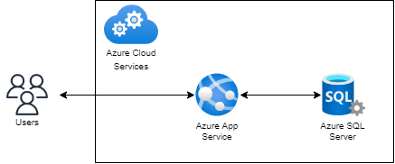

# T11-Kalaroo Project

# 1. Overall

This is the first iteration of project. In this iteration, at the initial stage, the research topic was refined into different dimensions through the lotus blossom and empathy map methods. After this, Personas and problem statements were conducted based on the previous stage results, aiming to summarise user groups, which indicates the users’ needs, and why they are important to them. 
In this iteration development, two epics will be implemented into functions in which people can get information about endangered land animals and habitats knowledge, and are free to subscribe to the news and activities without any mandatory. In addition, the initial version project basically met the needs of users, but there were still some shortcomings, after improvement, we have the delivery version project with fully functional and more interactive UI design, and we are ready to delivery this project to our user.

# 2. Software architecture and design principle involved

<h1>3.Tech and Framework</h1>
<li>.NET MVC
<li>boostrap
<li>Microsoft Access Database
<li>EF Framwork
<li>Razor Engine
<h1>Libraries and Package</h1>
<li>jquery（v-3.4.1）
<li>jquery datatable(v1.11. 5)
<li>boostrap(v5)
<li>modernizr(v 2.8.3)
<li>GoogleFont 
<li>Razor Engine(v5)
<h1>4.3Installation</h1> 
<li>install jquery package or import by using ()
<li>instaill jquery datatable (https://cdn.datatables.net/)
<li>boostrap -Download and import
<li>modernizr-Download and import
<li>GoogleFont- import(https://fonts.google.com/)
